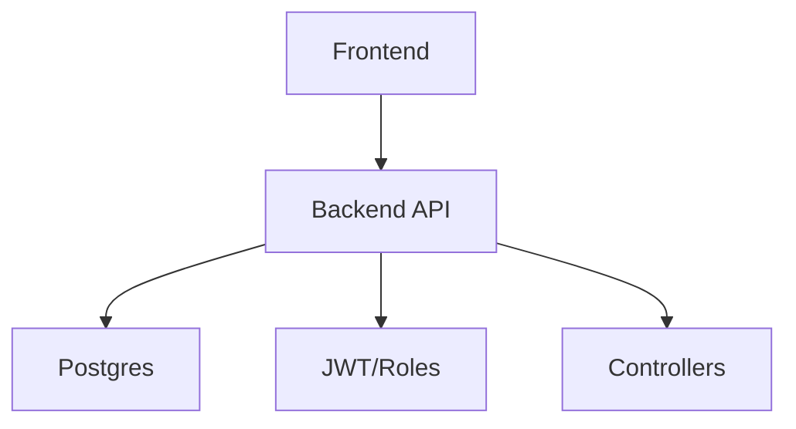
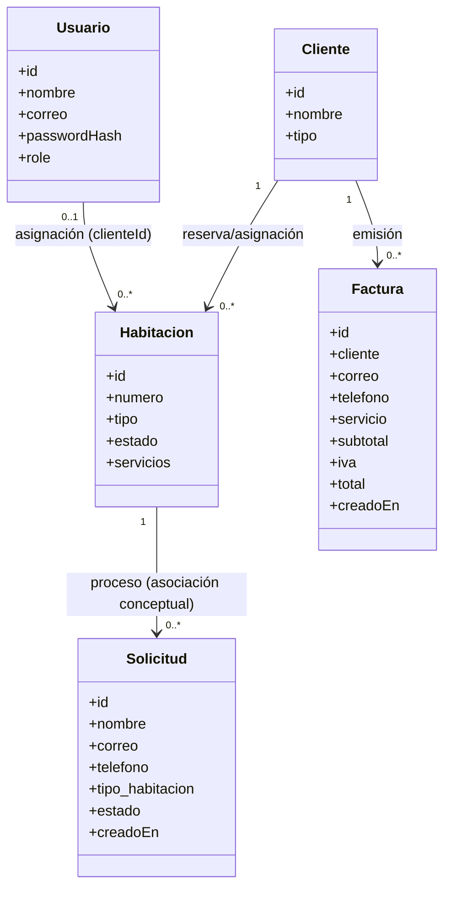

# DocuFinal — Estructura Oficial del Documento Final y Pitch de Defensa UNCSM

> Documento único (versión para impresión/exposición).

---

## Portada Oficial

**Universidad Nacional Casimiro Sotelo Montenegro**  
**Facultad de Ingeniería y Tecnología**  

**Proyecto:** *Modernización y Plan de Reingeniería del Sistema*  

**Integrantes (nombres completos):**  
- [Nombre completo 1] — Rol: [Rol asignado]  
- [Nombre completo 2] — Rol: [Rol asignado]  
- [Nombre completo 3] — Rol: [Rol asignado]  

**Docente de la asignatura:** [Nombre del docente]  

**Fecha de entrega:** [dd/mm/aaaa]

---

## Índice de Contenido

> Inserta aquí la **tabla de contenido generada automáticamente** por el editor (Word/Docs) para que coincida exactamente con las páginas.

---

## Índices Especiales

- **Índice de Tablas:** [generar automáticamente]
- **Índice de Figuras:** [generar automáticamente]
- **Índice de Anexos:** [generar automáticamente]

---

## Introducción y Objetivos

El presente documento sistematiza la modernización del sistema del *Hotel Transilvania* mediante un plan de reingeniería orientado a mejorar mantenibilidad, escalabilidad y calidad del software. La intervención se fundamenta en el diagnóstico de la línea base, la identificación de problemas técnicos y de proceso con impacto sobre el comportamiento del sistema y la evaluación económica y técnica de la alternativa de modernización frente a rehacer el sistema desde cero.

### Objetivo general

- Modernizar y reingenierar el sistema, aplicando un plan técnico-económico sustentado que reduzca la deuda técnica y mejore la confiabilidad del producto.

### Objetivos específicos

- Analizar la línea base del sistema e identificar fallas de diseño y limitaciones de escalabilidad.
- Clasificar y justificar las acciones de mantenimiento ejecutadas (correctivo, adaptativo, perfectivo y preventivo).
- Estimar costos funcionales y algorítmicos utilizando IFPUG y modelar el esfuerzo con COCOMO II (Post-Arquitectura).
- Diseñar la gestión formal de cambios mediante SCM con flujo RFC y estrategia de versionado en Git.
- Elaborar evidencia de aseguramiento de calidad, conclusiones y lecciones aprendidas.

---

# CAPÍTULO I: Línea Base del Sistema (Aspectos ISW1)

## 1.1 *Descripción del Sistema Original*

Antes de la modernización, el sistema del hotel operaba como una aplicación web con **backend en Node.js/Express** y persistencia en **Postgres**, gestionada mediante **Prisma**. El acceso y las operaciones estaban condicionados por lógica de autenticación y autorización por rol.

Las reglas de negocio identificadas incluyen:

- Gestión de **usuarios** con roles (*ADMIN/USER*) para restringir operaciones críticas.
- Administración de **clientes** con tipos (*Normal/Deluxe/VIP*).
- Administración de **habitaciones** con estado (*Libre/Ocupada*) y compatibilidades por tipo.
- Gestión de **solicitudes** (*pendiente/aprobada/rechazada*) como antecedente para asignación de habitaciones.
- Emisión de **facturas** con cálculo de subtotal, IVA y total.

> Figura 1. Diagrama de contexto (línea base)



**Lectura del diagrama (Figura 1):**
- El Frontend consume la API del Backend.
- El Backend persiste datos en Postgres.
- La API aplica autenticación/autorización por roles (JWT).
- Los Controllers coordinan la lógica de negocio.

*Nota de autoría (izquierda):* [Autor / Equipo / Fecha]

---

## 1.2 *Herramientas y Entorno Inicial*


La pila tecnológica inicial del sistema se compone de:

- Backend: **Node.js + Express** (API REST)
- Persistencia: **Prisma**
- Base de datos: **Postgres**
- Autenticación y autorización: **JWT** con middleware (`backend/middleware/authMiddleware.js`)
- Frontend: recursos estáticos (HTML/CSS/JS) que consumen endpoints mediante `fetch`
- Versionado: **Git**

## 1.3 *Arquitectura y Requerimientos Críticos*

La arquitectura de la línea base se caracteriza por:

- Endpoints y lógica concentrados principalmente en `backend/index.js`.
- Middleware de autenticación y roles.
- Modelado de entidades mediante esquemas Prisma.

En los diagramas UML y flujos iniciales se identifican los siguientes puntos de falla (explícitos):

1. **Centralización de rutas/lógica** en `backend/index.js` (acoplamiento y dificultad de escalamiento).
2. **Riesgo de desalineación** entre el esquema esperado por el backend (JWT en `Authorization`) y el comportamiento real del frontend.
3. **Ausencia de trazabilidad formal** en el ciclo de cambios (impacta calidad y reversibilidad).

> Figura 2. Diagrama de clases (UML) — versión conceptual (corregida)



*Nota de autoría (izquierda):* [Autor / Equipo / Fecha]

> Figura 3. Casos de uso (UML) — visión de interacción

```mermaid
usecaseDiagram
  actor Usuario as U
  actor Administrador as A

  rectangle "Hotel Transilvania" {
    (Iniciar sesión) as UC2
    (Ver habitaciones) as UC3
    (Solicitar reserva) as UC4
    (Ver mis solicitudes) as UC5

    (Aprobar solicitud) as UC6
    (Rechazar solicitud) as UC7
    (Administrar clientes) as UC8
    (Generar/ver facturas) as UC9

    (Reset BD) as UC10
  }

  U --> UC2
  U --> UC3
  U --> UC4
  U --> UC5

  A --> UC6
  A --> UC7
  A --> UC8
  A --> UC9
  A --> UC10
```

*Nota de autoría (izquierda):* [Autor / Equipo / Fecha]

---

# CAPÍTULO II: Definición y Análisis de Mantenimiento

## 2.1 *Diagnóstico de Problemas Actuales*

Se priorizan tres problemas técnicos y/o de proceso identificados en la línea base:

1. **Centralización de lógica**: genera acoplamiento y complica el testeo.
2. **Coherencia de autenticación**: el middleware opera con JWT en header; el frontend debe enviar `Authorization: Bearer <token>`.
3. **Cambios no formalizados**: sin RFC/criterios, aumenta riesgo de regresiones.

## 2.2 *Matriz de Clasificación de Mantenimiento*

> Tabla 1. Matriz de clasificación de mantenimiento

| Categoría | Acciones técnicas planificadas/ejecutadas | Evidencia / Resultado esperado |
|---|---|---|

| Correctivo | Corrección de fallos críticos (control de acceso, reglas de compatibilidad por rol/tipo). | Menor tasa de errores en flujos sensibles. |
| Adaptativo | Adecuación de entorno (CORS/orígenes) y alineación con JWT del backend. | Funcionamiento estable entre entornos (local/proyecto). |
| Perfectivo | Refactorización y mejoras de tiempos de respuesta; optimización de consultas. | Mejor mantenibilidad y desempeño. |
| Preventivo | Auditoría de seguridad (validaciones, robustecimiento) y hardening. | Menor superficie de ataque y mayor resiliencia. |

*Nota de autoría (izquierda):* [Autor / Equipo / Fecha]

---

# CAPÍTULO III: Análisis Económico y Plan de Reingeniería

## 3.1 *Estimación de Costos Funcionales y Algorítmicos*

> Tabla 2. Estimación IFPUG y COCOMO II (plantilla)

| Concepto | Parámetro | Valor | Observación |
|---|---|---:|---|
| IFPUG | PFNA | [ ] | Completar conteo |

| IFPUG | Factor de Ajuste (F) | [ ] | Completar |
| IFPUG | PFA = PFNA×(F/100) | [ ] | Cálculo |
| Conversión | KLOC | [ ] | Conversión |
| COCOMO II | Esfuerzo (PM) | [ ] | Resultado |
| COCOMO II | Duración (meses) | [ ] | Resultado |

*Nota de autoría (izquierda):* [Autor / Equipo / Fecha]

## 3.2 *Justificación Financiera del Proyecto*

> Tabla 3. Comparativa financiera (plantilla)

| Alternativa | Costo estimado | Riesgo asociado | Impacto esperado |
|---|---:|---|---|
| Modernización y reingeniería | [ ] | [ ] | Menor retrabajo relativo |
| Rehacer desde cero | [ ] | [ ] | Mayor desviación y retrabajo |

*Nota de autoría (izquierda):* [Autor / Equipo / Fecha]

## 3.3 *Plan de Reingeniería Técnica*

> Figura 4. Diagrama de flujo de migración (plantilla)

```mermaid
flowchart TD
  A[Monolito funcional / rutas en index.js] --> B[Separación por capas (rutas/controles/servicios)]
  B --> C[Fortalecimiento de seguridad y coherencia JWT]
  C --> D[Optimización y refactorización de reglas]
  D --> E[Validación, pruebas y despliegue incremental]
  E --> F[Operación estable con SCM + RFC]
```

*Nota de autoría (izquierda):* [Autor / Equipo / Fecha]

---

# CAPÍTULO IV: Gestión de Configuración del Software (SCM)

## 4.1 *Diseño del Flujo RFC*

> Figura 5. Flujo secuencial RFC

```mermaid
flowchart TD
  R[Solicitud inicial (RFC)] --> A[Análisis de impacto técnico]
  A --> C[Aprobación por comité]
  C --> I[Implementación del cambio]
  I --> T[Fase de pruebas de calidad]
  T --> V[Verificación y despliegue]
  V --> B[Registro y cierre del RFC]
```

*Nota de autoría (izquierda):* [Autor / Equipo / Fecha]

## 4.2 *Estrategia de Versionado y Control de Código (Git)*

- Estables: `main`/`master`
- Desarrollo: `develop`
- Características: `feature/<nombre>`
- Emergencia: `hotfix/<nombre>`

Plataforma: [GitHub/GitLab/Bitbucket — completar]

---

# CAPÍTULO V: Consolidación y Cierre

## 5.1 *Checklist de Aseguramiento de Calidad*

> Tabla 4. Checklist

| Criterio / Entregable | Evidencia | Estado |
|---|---|---|
| Portada y estructura | Documento final configurado | [ ] |
| Diagramas UML | Figuras en el documento | [ ] |
| Matriz mantenimiento | Tabla 1 | [ ] |
| IFPUG/COCOMO II | Tablas 2–3 | [ ] |
| Flujo RFC | Figura 5 | [ ] |
| Anexos | Anexos A y B | [ ] |

*Nota de autoría (izquierda):* [Autor / Equipo / Fecha]

## 5.2 *Conclusiones y Lecciones Aprendidas*

Las conclusiones se sustentan en:

- Riesgos técnicos mitigados (acoplamiento, coherencia de auth, trazabilidad).
- Gestión de deuda técnica (correctivo, perfectivo, preventivo y adaptativo).
- Decisiones bajo presión con soporte en evidencia (métricas, tablas y diagramas).

---

# ANEXO A: Manual de Usuario (Prototipo Funcional)

- Capturas de pantalla numeradas (Figura A.1, Figura A.2, etc.) con descripciones operativas.

*Nota de autoría (izquierda):* [Autor / Equipo / Fecha]

---

# ANEXO B: Manual del Administrador e Instrucciones de Mantenibilidad

- Instalación del entorno.
- Diccionario de datos.
- Guía CI/CD para producción.
- Comandos esenciales para puesta en marcha.

*Nota de autoría (izquierda):* [Autor / Equipo / Fecha]

