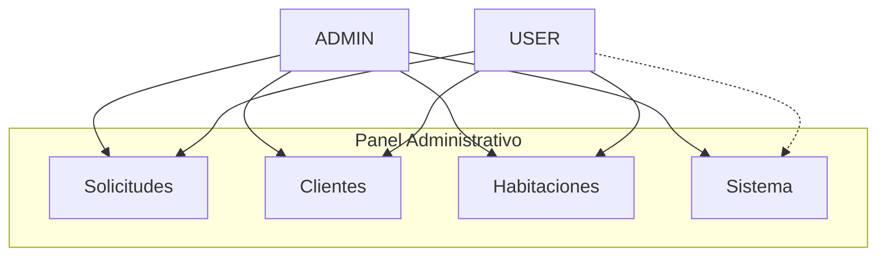

# Roles y estructura del panel (Admin vs Cliente/Usuario)

Este documento describe una estructura típica con los roles definidos en Prisma:
- `ADMIN`
- `USER`

> Base de roles: `backend/prisma/schema.prisma` (enum `Role`).

---

## 1) Roles disponibles

### ADMIN
- Control total del sistema.
- Puede ejecutar acciones administrativas y ver todo el panel.

### USER
- Empleado/recepcionista/usuario operativo (según tu concepto).
- Puede operar con funciones del día a día.

> Nota: En el repo, el backend **sí** guarda `role` en `Usuario`, pero para que el acceso sea 100% seguro se recomienda implementar un middleware que valide el rol antes de cada endpoint sensible.

---

## 1.1 UML (subcarpetas/áreas por rol)

La idea es mostrar módulos separados (por dominio) y qué rol los usa.

### UML de componentes (áreas por rol)



### UML de estructura (plantilla de subcarpetas)

```mermaid
flowchart TD
  PanelAdmin[admin/ (Frontend y backend protegidos)]

  PanelAdmin --> ModSolicitudes[mod-solicitudes/]
  PanelAdmin --> ModClientes[mod-clientes/]
  PanelAdmin --> ModHabitaciones[mod-habitaciones/]
  PanelAdmin --> ModSistema[mod-sistema/]

  ModSolicitudes --> UI1[UI: ver/gestionar solicitudes]
  ModClientes --> UI2[UI: clientes]
  ModHabitaciones --> UI3[UI: habitaciones]
  ModSistema --> UI4[UI: reset/global]
```

---

## 2) Estructura del panel (frontend)

El frontend usa pantallas HTML independientes. La idea para roles es:
- **ADMIN**: ve la pantalla completa del panel de administración (`Frontend/admin.html`).
- **USER** (recepción/usuario): ve una pantalla “operativa” (puede reutilizar partes de `admin.html`, pero idealmente sería una vista diferente) con menos acciones.

En tu proyecto ya existen:
- `Frontend/login.html`: pantalla de acceso.
- `Frontend/admin.html`: panel completo.

### 2.1 Qué ve ADMIN (Administrador)


En `admin.html`/secciones controladas por `app.js` debería verse:

1. **Estado del hotel**
   - Resúmenes y vista global (si existe en tu UI).

2. **Gestión de Solicitudes** (completo)
   - Ver solicitudes
   - Aprobar solicitudes
   - Rechazar solicitudes

3. **Gestión de Clientes** (completo)
   - Ver clientes
   - Crear/actualizar tipo de cliente
   - Eliminar clientes

4. **Gestión de Habitaciones** (completo)
   - Ver habitaciones
   - Crear habitaciones
   - Ocupar habitaciones
   - Liberar habitaciones
   - Eliminar habitaciones

5. **Sistema** (acciones globales)
   - Resetear el sistema (endpoint como `/reset`, si aplica)

---

### 2.2 Qué ve USER (Cliente/Usuario operativo / Recepcionista)

En `admin.html` debería verse una versión limitada:

1. **Gestión de Solicitudes** (operativa)
   - Ver solicitudes
   - (Opcional según tu diseño) Aprobar/Rechazar

2. **Gestión de Habitaciones**
   - Ver habitaciones
   - Ocupar y liberar habitaciones

3. **Gestión de Clientes**
   - Ver clientes
   - Actualizar tipo (si aplica)
   - Crear/eliminar según tu diseño (típicamente limitado)

4. **Sistema**
   - Generalmente **NO** debería permitir reset global.

---

## 3) Diagrama conceptual de permisos (simple)

| Función del panel                          | ADMIN | USER |
|-------------------------------------------|:-----:|:----:|
| Ver solicitudes                           |  ✅    |  ✅  |
| Aprobar solicitudes                       |  ✅    | (✅/⚠️) |
| Rechazar solicitudes                      |  ✅    | (✅/⚠️) |
| Ver clientes                              |  ✅    |  ✅  |
| Crear/editar/eliminar clientes           |  ✅    | (⚠️) |
| Ver habitaciones                           |  ✅    |  ✅  |
| Crear habitaciones                         |  ✅    | (⚠️) |
| Ocupar / liberar habitaciones             |  ✅    |  ✅  |
| Eliminar habitaciones                      |  ✅    | (⚠️) |
| Resetear sistema                          |  ✅    |  ❌  |

> “⚠️” significa: depende de cómo quieras limitar el acceso en tu proyecto.

---

## 4) Cómo “se enseña” en el proyecto (ejecución práctica)

Para que sea coherente entre frontend y backend:

1) **En backend**
- Crear middleware `requireRole('ADMIN' | 'USER')`
- Antes de rutas sensibles, verificar `usuario.role`.

2) **En frontend**
- Después del login, guardar `role` (o el usuario completo) en sesión/localStorage.
- Mostrar/ocultar botones y secciones según role.

---

## 5) Evidencia de roles
- Prisma define `enum Role { ADMIN, USER }`
- `Usuario.role` por defecto es `USER`.

---

## 6) Archivos relacionados
- `backend/prisma/schema.prisma`
- `backend/controllers/authController.js`
- `Frontend/admin.html`
- `Frontend/app.js`


