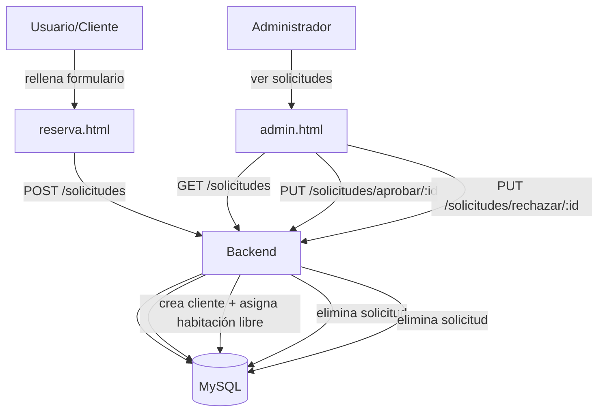
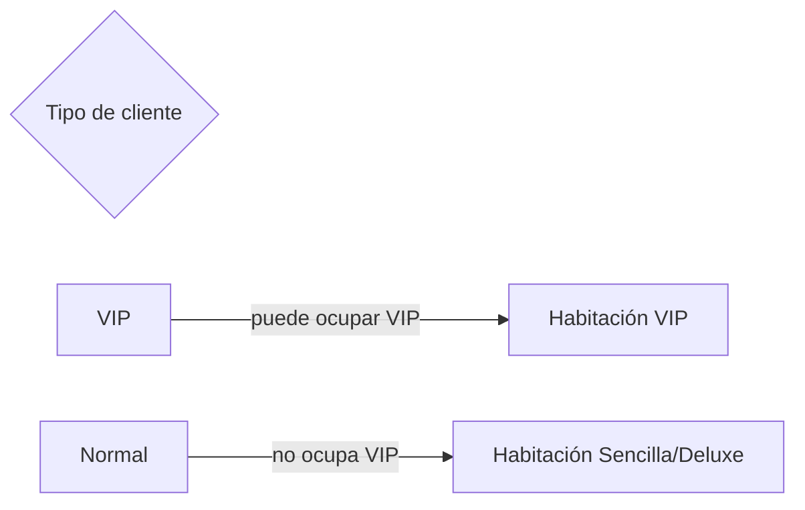

# Hotel Aurora (Documentación corta)

Aplicación web para la **gestión de un hotel**.
- Frontend: páginas HTML/JS (público + panel admin)
- Backend: Node.js + Express (API)
- Base de datos: MySQL (con conexión desde `backend/db.js`)

---

## Estructura del proyecto

```text
.
├─ backend/
│  ├─ db.js
│  ├─ server.js
│  ├─ controllers/
│  │  ├─ authController.js
│  │  ├─ clientesController.js
│  │  ├─ habitacionesController.js
│  │  ├─ solicitudesController.js
│  │  └─ facturasController.js
│  ├─ Routes/
│  │  ├─ auth.js
│  │  ├─ clientes.js
│  │  ├─ habitaciones.js
│  │  ├─ solicitudes.js
│  │  └─ facturas.js
│  ├─ prisma/
│  │  ├─ schema.prisma
│  │  └─ (migraciones)
│  └─ sql/
│     └─ add_servicios_habitaciones.sql
│
├─ Frontend/
│  ├─ *.html (index, alojamiento, reserva, admin, etc.)
│  ├─ *.js (app.js, reservas.js, verHabitaciones.js, facturacion.js, etc.)
│  └─ *.css
│
└─ Documentacion/
   └─ Readme.md
```

---

## Diagrama UML (arquitectura / componentes)

```mermaid
flowchart TB
  subgraph Cliente[Navegador]
    FE[Frontend público]
    AD[Panel Admin (admin.html)]
  end

  subgraph API[Backend Node.js + Express]
    R1[Routes]
    CAuth[Auth Controller]
    CClientes[Clientes Controller]
    CHab[Habitaciones Controller]
    CSol[Solicitudes Controller]
    CFac[Facturas Controller]
  end

  subgraph Datos[Datos]
    DB[(MySQL: hotel_db)]
    PRISMA[Prisma schema.prisma (opcional)]
  end

  FE -->|HTTP| R1
  AD -->|HTTP| R1

  R1 --> CAuth
  R1 --> CClientes
  R1 --> CHab
  R1 --> CSol
  R1 --> CFac

  CAuth --> DB
  CClientes --> DB
  CHab --> DB
  CSol --> DB
  CFac --> DB

  API -.-> PRISMA
```

---

## Diagrama UML (caso de uso: Reserva y aprobación)



---

## Reglas de negocio (VIP vs Normal)



---

## Cómo ejecutar (resumen)

1. Entrar a `backend/`
2. Instalar dependencias:
   ```bash
   npm install
   ```
3. Iniciar servidor:
   ```bash
   node server.js
   ```
4. Abrir el frontend (navegador) usando las páginas de `Frontend/`.

---

## Documentación adicional
- `Documentacion/Readme.md`
- `README.md` (root del proyecto)

